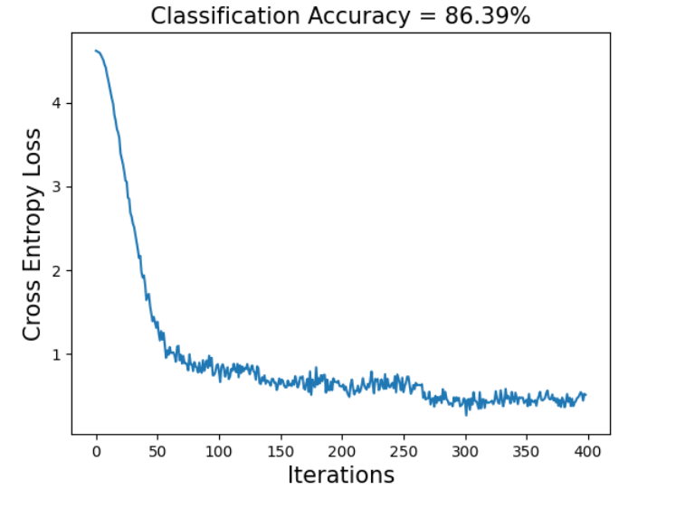

# Food-101-Classifcation-using-Distilbert-and-LSTM
This repository compares the performace of two deep learning architectures, DistilBert transformer and LSTM, for classification on the [Food 101-Dataset](https://data.vision.ee.ethz.ch/cvl/datasets_extra/food-101/). The Food-101 dataset comprises 250 images and the corresponding captions of each of the 101 food dishes.  We only use the text captions in our coomparison. The text files, `train_titles.csv` and `test_titles.csv`, are provided in the repository.  

# Files and description
There are two python code files in this repository, which are explained below: 

**1. distilBertClassifier.ipynb:** python notebook that imports the pre-trained distilbert transfomer from huggingface, fine-tunes the weights, and tests the fine-tuned model.

**2. lstmClassifier.ipynb:** python notebok that trains and tests the lstm + feedfoward network using pytorch.

The test and train dataset, `train_titles.csv` and `test_tiles.csv`, are also included in the repsitory.

Please email any questions to aabbasi1@iastae.edu 

# Expected Output

- The distilbert clasifier achieves an expected 86 percent classification accuracy on the text Food 101 Dataset.

- A good sanity check  is to inspect a single data point output from the data loaders by decoding the output token ids and reading the decoded sentence to see if it makes sense. For example, 

  `Encoded Text = tensor([  101,  3313,  6207, 11345,  2007,  9781,  4168,  2389, 19116, 17974,
           1064,  2026,  2890,  6895, 10374,  1012,  4012,   102,     0,     0,
              0,     0,     0,     0,     0,     0,     0,     0,     0,     0,
              0,     0,     0,     0,     0,     0,     0,     0,     0,     0,
              0,     0,     0,     0,     0,     0,     0,     0,     0,     0,
              0,     0,     0,     0,     0,     0,     0,     0,     0,     0,
              0,     0,     0,     0,     0,     0,     0,     0,     0,     0,
              0,     0,     0,     0,     0,     0,     0,     0,     0,     0,
              0,     0,     0,     0,     0,     0,     0,     0,     0,     0,
              0,     0,     0,     0,     0,     0,     0,     0,     0,     0,
              0,     0,     0,     0,     0,     0,     0,     0,     0,     0,
              0,     0,     0,     0,     0,     0,     0,     0,     0,     0,
              0,     0,     0,     0,     0,     0,     0,     0]), torch.LongTensor, torch.Size([128])`

  `Decoded tokens from encoded ids: 
  '[CLS] double apple pie with cornmeal crust recipe | myrecipes. com [SEP] [PAD] [PAD] [PAD] [PAD] [PAD] [PAD] [PAD] [PAD] [PAD] [PAD] [PAD] [PAD] [PAD] [PAD] [PAD] [PAD] [PAD] [PAD] [PAD] [PAD] [PAD] [PAD] [PAD] [PAD] [PAD] [PAD] [PAD] [PAD] [PAD] [PAD] [PAD] [PAD] [PAD] [PAD] [PAD] [PAD] [PAD] [PAD] [PAD] [PAD] [PAD] [PAD] [PAD] [PAD] [PAD] [PAD] [PAD] [PAD] [PAD] [PAD] [PAD] [PAD] [PAD] [PAD] [PAD] [PAD] [PAD] [PAD] [PAD] [PAD] [PAD] [PAD] [PAD] [PAD] [PAD] [PAD] [PAD] [PAD] [PAD] [PAD] [PAD] [PAD] [PAD] [PAD] [PAD] [PAD] [PAD] [PAD] [PAD] [PAD] [PAD] [PAD] [PAD] [PAD] [PAD] [PAD] [PAD] [PAD] [PAD] [PAD] [PAD] [PAD] [PAD] [PAD] [PAD] [PAD] [PAD] [PAD] [PAD] [PAD] [PAD] [PAD] [PAD] [PAD] [PAD] [PAD] [PAD] [PAD] [PAD] [PAD]'`

  Notice how the decoded sentence has special tokens like [CLS], [SEP], [PAD] that indicate the Start-of-Sentece/Classification token, the Separator/End-of-sentence token and the padding token [PAD].

